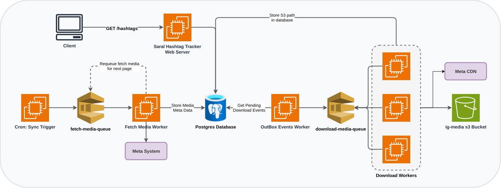

# Saral Hashtag Tracker

A highly scalable, background-worker driven backend application to track, fetch, and download Instagram media for specific hashtags using the Meta Graph API.

## Architecture & Data Flow

This project is built using a **Background Worker Architecture** and the **Outbox Pattern** to ensure high throughput, reliability, and strict idempotency.

<!-- Note: Export your .drawio file as an SVG or PNG and save it as architecture.svg in the docs/images folder -->
<div align="center">
  
</div>

The system consists of a main API server, a cron scheduler, and three background workers. 

The cron scheduler is built using `node-cron`. It acts as an alarm clock, triggering `SYNC_RECENT_POST` every 3 hours and `SYNC_TOP_POST` every 12 hours.

The three background workers are responsible for the following:
1. **Fetch Worker**: Fetches data from the Meta API and stores it in the database.
2. **Outbox Worker**: Handles distributed failures between PostgreSQL and SQS. Since atomic updates cannot be guaranteed across two separate services in a single transaction, the Fetch Worker writes download events to an `outbox_events` table in PostgreSQL. The Outbox Worker queries this table and safely delegates the download tasks to the Download Worker via SQS.
3. **Download Worker**: Downloads the media retrieved from the Meta API and uploads it to S3.

### The Services
Instead of a single monolithic process, the application is broken down into 5 independent containers:
1. **API Server (`server`)**: The Express REST API for querying tracked hashtags and retrieving paginated media.
2. **Cron Scheduler (`cron`)**: Acts as an alarm clock, periodically triggering sync jobs for active hashtags.
3. **Fetch Worker (`fetch_media_worker`)**: Polls the SQS `fetch-media-queue`. Calls the Meta API to sync post metadata (likes, comments, captions) and safely `UPSERT`s it into PostgreSQL. If it finds a new post, it drops a job in the database outbox.
4. **Outbox Worker (`outbox_worker`)**: Polls the PostgreSQL `outbox_events` table for `PENDING` download jobs and pushes them to the SQS download queue.
5. **Download Worker (`download_media_worker`)**: Polls the SQS `download-media-queue`. Downloads the raw `.mp4` or `.jpg` assets from Meta and uploads them directly to S3 (LocalStack), avoiding blocking the main sync flow. Download workers can be scaled horizontally.

### Database Schema
The database is highly normalized to separate "hot" (frequently updating) data from "cold" data, and is heavily optimized for concurrent insertions:
1. **`tracked_hashtags`**: Stores the core hashtags the system is monitoring, including their Meta IDs and active status.
2. **`media`**: Stores the immutable/cold metadata for an Instagram post (ID, caption, permalink, and S3 `asset_key`). It utilizes a partial index on `posted_at` to highly optimize queries that only fetch downloaded media.
3. **`media_metrics`**: Stores the volatile/hot data (likes and comments counts). Since this data is continuously updated on every cron cycle, isolating it into a 1-to-1 table prevents bloated updates and excessive row-locking on the main `media` table.
4. **`media_hashtags`**: A many-to-many join table linking posts to hashtags. A single post can belong to multiple tracked hashtags. It also stores an array of `sources` (e.g., `TOP`, `RECENT`) to track exactly how a post was discovered.
5. **`outbox_events`**: The core of the Transactional Outbox Pattern. When a post is saved, an event is atomically written here. The Outbox Worker queries `PENDING` rows to safely dispatch download jobs to SQS, bridging the gap between PostgreSQL and the distributed queue.

### Project Structure
- `src/modules/`: Contains the Express API controllers, models, and validators.
- `src/worker/`: Contains the background worker processes and their handlers.
- `src/services/`: Shared service singletons (Queue, S3, Meta API wrapper).
- `src/db/`: Knex migrations, seeds, and database configuration.
- `src/config/`: Dynamic, environment-driven configuration schema.

## Prerequisites
- **Docker**
- **Docker Compose**
- A valid **Meta Graph API Token** and **User ID** (Place these in your `.env`)

## Setup

1. **Environment Config:**
   Copy `.env.example` to `.env` and fill in your Meta API credentials.
   
2. **Start the Stack (Dockerized):**
   I have provided a unified startup script that handles database creation, migrations, seeding, LocalStack bucket/queue creation, and building the Docker images.
   ```bash
   chmod +x start.sh
   ./start.sh
   ```

3. **Accessing the App:**
   - The Webserver is available at: `http://localhost:3000`
   - Postgres is exposed on: `localhost:15432`
   - LocalStack (S3/SQS/Secrets Manager) is exposed on: `localhost:4566`

## Tuning & Configuration

Because the application is highly decoupled, it is designed to be easily tunable without changing code. In particular, the **Download Workers**—which handle the most time-consuming task of streaming media to S3—can be scaled horizontally to dramatically increase throughput.

Every key component is strictly configured via the `.env` file. Below is a detailed explanation of the essential environment variables:

### Environment Variables

Below is a detailed explanation of all the configuration variables found in `.env`:

- **Common**
  - `PORT`: The port the Express API server listens on (default: `3000`).

- **Meta API** 
  - `META_ACCESS_TOKEN` & `META_USER_ID`: Your Meta Graph API authentication credentials.
  - `META_MEDIA_FETCH_LIMIT`: The total maximum number of posts to fetch per sync run.
  - `META_API_PAGE_LIMIT`: The number of posts fetched per API page (keep this ≤ 5 to avoid rate-limit errors).

- **Worker Tuning** 
  - `WORKER_OUTBOX_BATCH_SIZE`: The number of pending jobs the Outbox Worker pulls from the database in a single query.
  - `WORKER_FETCH_MEDIA_SQS_POLL_BATCH_SIZE`: The number of messages the Fetch Worker pulls from SQS per poll.
  - `WORKER_DOWNLOAD_MEDIA_SQS_POLL_BATCH_SIZE`: The number of concurrent download jobs a Download Worker pulls from SQS.

- **AWS / LocalStack**
  - `AWS_REGION`: The AWS region (e.g., `us-east-1`).
  - `AWS_ACCESS_KEY_ID` & `AWS_SECRET_ACCESS_KEY`: Dummy credentials for LocalStack (e.g., `test`).
  - `AWS_ENDPOINT` & `AWS_PUBLIC_ENDPOINT`: The URL endpoints for the LocalStack service.
  - `AWS_SECRET_ID`: The name of the AWS Secrets Manager secret holding your DB credentials.
  - `SQS_FETCH_MEDIA_QUEUE_URL`: The URL for the Fetch Worker SQS queue.
  - `SQS_DOWNLOAD_MEDIA_QUEUE_URL`: The URL for the Download Worker SQS queue.
  - `S3_BUCKET_NAME`: The name of the local S3 bucket used to store downloaded Instagram media.

> 🔒 **Security Note:** The `DATABASE_URL` is **not** stored in `.env`. Instead, it is automatically seeded into AWS Secrets Manager (mocked via LocalStack) by the `start.sh` script, and fetched securely by the workers at runtime.

## API Usage

### Get Media for a Hashtag

Fetch paginated, downloaded media for a tracked hashtag. Only returns posts that have a fully downloaded S3 asset.

```bash
curl --location --request GET 'http://localhost:3000/api/hashtags?name=matcha&page=1&limit=100'
```

**Query Parameters:**

| Parameter | Type | Required | Description |
|---|---|---|---|
| `name` | string | ✅ Yes | The hashtag name to query (without `#`) |
| `page` | number | No | Page number (default: `1`) |
| `limit` | number | No | Items per page, max `100` (default: `20`) |

## Implementation & Technical Decisions

This section outlines the specific architectural design choices and optimizations I implemented during the development of the Hashtag Tracker from scratch.

### 1. Concurrency & Race Conditions
To cleanly handle scenarios where multiple workers (e.g., `SYNC_TOP` and `SYNC_RECENT` cron jobs) fetch the exact same Instagram post simultaneously, database conflicts are handled safely via merging rather than traditional check-then-act insertions.

### 2. Queue Reliability (Outbox Pattern)
I implemented the Transactional Outbox Pattern to guarantee that if a post is saved to the database, a download job is reliably sent to SQS. Without this pattern, an atomic transaction cannot be guaranteed across two separate distributed systems (PostgreSQL and SQS). If the server crashed immediately after saving to the database but before pushing the message to the queue, the media download job would be permanently lost. By writing jobs to a local `outbox_events` table within the same database transaction, I guarantee strictly consistent data flow between the services.

### 3. Strict Idempotency
Because network requests to SQS can fail or timeout, the background workers are built to safely handle duplicate messages (At-Least-Once Delivery). 
- `fetch_media_worker`: Entirely wrapped in a DB transaction and utilizes native PostgreSQL `UPSERT` capabilities (`ON CONFLICT DO UPDATE`) on `ig_media_id`.
- `download_media_worker`: Begins with a rapid database check (`SELECT asset_key`). If the file was already downloaded from a previous attempt, it instantly drops the duplicate job, saving heavy Meta API bandwidth and redundant S3 PUT operations.

### 4. Security & Centralized Configuration
To ensure a robust and strictly typed environment, all environment variables are parsed inside a centralized `src/config/env.ts` singleton. The entire codebase exclusively references this singleton, with the deliberate exception of `logger.ts` (which reads `NODE_ENV` and `LOG_LEVEL` directly from `process.env` to break a circular dependency, as it must load before `config`). 
Furthermore, I integrated the application to pull critical credentials (like `DATABASE_URL`) directly from AWS Secrets Manager (mocked via LocalStack) at startup. The `start.sh` script provisions this mock secret on boot, while all other variables (Meta tokens, SQS URLs, worker tuning) remain in `.env`.

### 5. LocalStack (Offline AWS)
To develop and run this architecture locally without incurring cloud costs or requiring real AWS credentials, I used **LocalStack**—a fully functional local AWS cloud stack. It allowed me to mock essential AWS services like S3 (for media storage), SQS (for distributed background queuing), and Secrets Manager (for secure credential retrieval) entirely offline. This ensures the codebase is instantly production-ready for a real AWS environment by simply swapping out the endpoints.

## Tradeoffs

1. **Meta API Limitations**: Currently, querying more than 5 records from the Meta API triggers a rate limiter error. For now, the fetch limit is set to 5 items per API call, which is configurable via the `.env` file.

## ai-usage

- **Which AI tools you used**: Google Gemini and Antigravity.
- **What you used them for**: I primarily used AI to write boilerplate code. This allowed me to spend most of my time designing a better database schema, planning a scalable architecture, and ensuring the system is fault-tolerant.
- **What you reviewed, tested, or wrote yourself**: I reviewed the AI-generated code, performed manual testing to verify its correctness, and structured the project folders according to my preferences. I also manually created a few of the core components and guided the AI through precise prompting to save time while maintaining control over the final output.